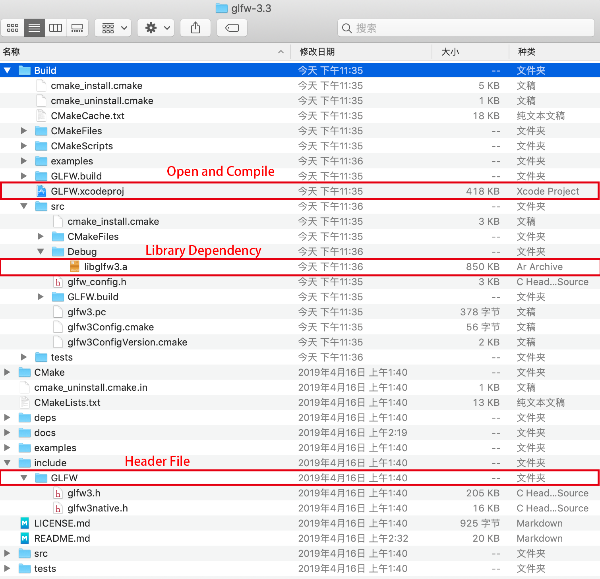
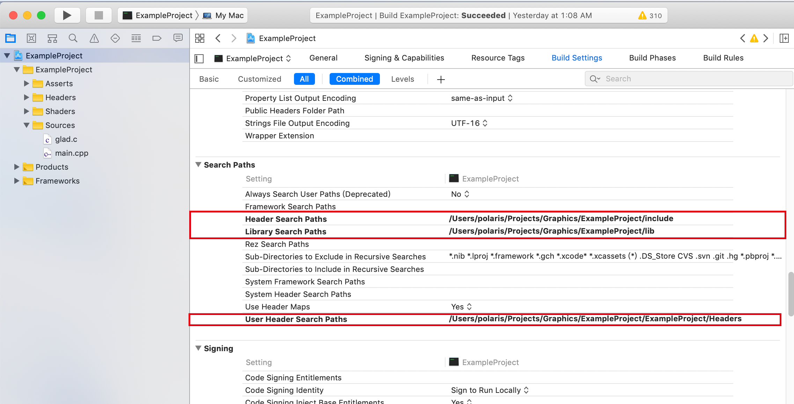
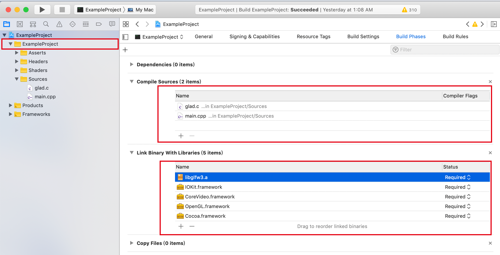
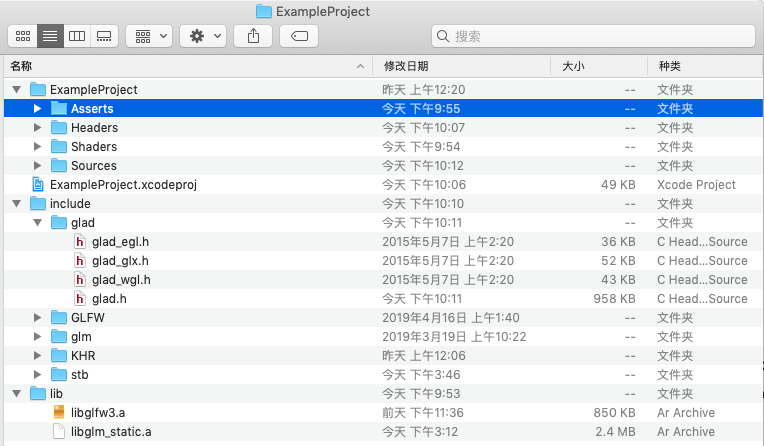

# 从零开始的图形学学习（零）：一切的开始 —— 自建OpenGL开发框架

## Outline

- Dependency: GLFW glad glm stb
- Development Environment: MacOS Xcode 11.2.1

## Part I. Introduction

图形学学习初期，在使用C++开发OpenGL项目时，不可避免的需要接触各种第三方依赖包的加载和对其进行开发平台/环境适配等问题。对于大部分C++基础不是特别牢固，或者对于开发平台IDE的工作原理不是特别熟悉的同学来说，这个过程不是特别友好。很容易把大把的时间和精力耗费在对第三方库文件的编译、链接等相关问题的解决上。

针对这种现象，目前有譬如[Glitter](https://github.com/Polytonic/Glitter)等项目框架集成了OpenGL各种常用的第三方依赖库，方便了图形学新手的学习。但是这一类集成框架具有以下三个小缺点：

- 框架体积过于庞大，每开启一个新项目就必须重新复制原有框架（文件体积大于1G），导致不必要的资源冗余。
- 在集成框架下，如果涉及到其他框架不具备的第三方依赖库，新手很难自行添加导致进度受阻难以进行。
- 无法比较简单地更改项目名称对于一些具有强迫症的开发人员很不友好。

---

本文主要致力于提供一种通过链接静态依赖库，自行搭建OpenGL开发框架的方法，以便于图形学新手思路清晰地学会自行加载第三方库以及对框架架构有一个整体的认识。框架体积小（约20MB），可调整性强，各种修改比较自由。

## Part II. Preparation

### 1. 建立框架文件架构。

对于常用的图形学项目而言，项目结构一般如下。

- ExampleProject（框架根文件夹，可以取任何名字。在此文件夹内创建Xcode新项目）
	- ExampleProject（此文件夹为Xcode项目目录，新建Asserts、Headers、Shaders、Sources文件夹）
		- Asserts（放置所有纹理、模型等资源）
		- Headers（放置所有用户定义头文件）
		- Shaders（放置所有渲染Shader文件）
		- Sources（放置main.cpp与glad.c这一类源程序文件）
	- include（所有第三方库的头文件放置处（.h文件））
	- lib（所有第三方库的lib文件放置处（.a文件））

### 2. 下载 Library [`GLFW`](https://www.glfw.org)

> 下载取得一个glfw-3-2.3.zip文件，mac下自动解压。

##### I. GLFW是什么？

- [GLFW](https://en.wikipedia.org/wiki/GLFW)为**G**raphics **L**ibrary **F**rame**w**ork的缩写。

##### II. GLFW的主要负责什么功能？

- 创建、管理窗口
- OpenGL Context
- 处理手柄、键盘、鼠标输入

##### III. 为什么要用glad？

- 因为OpenGL并没有提供窗口渲染的方法，必须依赖第三方库。

### 3. 下载适合您的 Library [`glad`](https://glad.dav1d.de)

>
将语言(Language)设置为C/C++，在API选项中，选择3.3以上的OpenGL(gl)版本，将模式(Profile)设置为Core，并且保证生成加载器(Generate a loader)的选项是选中的。现在可以先（暂时）忽略拓展(Extensions)中的内容。都选择完之后，点击生成(Generate)按钮来生成库文件。[1]下载取得一个glad.zip文件，mac下自动解压。

##### I. glad是什么？

- [glad](https://www.khronos.org/opengl/wiki/OpenGL_Loading_Library)为Open**GL** Lo**ad**ing Library的缩写。

##### II. glad的主要负责什么功能？

- 由于OpenGL只是一个**标准/规范**，具体的实现是由驱动开发商针对特定显卡实现的。而OpenGL驱动版本众多，它大多数函数的位置都无法在编译时确定下来，需要在运行时查询。所以任务就落在了开发者身上，开发者需要在运行时获取函数地址并将其保存在一个函数指针中供以后使用。取得地址的方法因平台而异，在Windows上会是类似这样：

		// 定义函数原型
		typedef void (*GL_GENBUFFERS) (GLsizei, GLuint*);
		// 找到正确的函数并赋值给函数指针
		GL_GENBUFFERS glGenBuffers  = (GL_GENBUFFERS)wglGetProcAddress("glGenBuffers");
		// 现在函数可以被正常调用了
		GLuint buffer;
		glGenBuffers(1, &buffer);

- 你可以看到代码非常复杂，而且很繁琐，我们需要对每个可能使用的函数都要重复这个过程。幸运的是，有些库能简化此过程，其中GLAD是目前最新，也是最流行的库。

##### III. 为什么要用glad？

- 一定程度上，glad能够用于在开发中取代[glew](https://en.wikipedia.org/wiki/OpenGL_Extension_Wrangler_Library)（Open**GL** **E**xtension **W**rangler Library）。glad是一个比较新的Lib，比较推荐XD。

### 4. 下载 Library [`glm`](https://github.com/g-truc/glm/releases/tag/0.9.9.6)

> 下载取得一个glm-0.9.9.6.zip文件，mac下自动解压。

##### I. glm是什么？
- [glm](https://github.com/g-truc/glm)是Open**GL** **M**athematics的缩写，它是一个**只有头文件**的库。

##### II. glm的主要负责什么功能？

- glm是一个数学函数库，包含图形领域数学常用的向量、矩阵等函数。

##### III. 为什么要用glm？

- OpenGL没有自带任何的矩阵和向量函数，所以我们必须定义自己的数学类和函数。glm抽象了所有的数学细节，为我们使用数学函数提供了方便。

### 5. 下载 Library [`stb`](https://github.com/nothings/stb)

> 下载整个仓库获得stb-master.zip，解压压缩包将文件夹重命名为stb。

##### I. stb是什么？

- [stb](https://github.com/nothings/stb)是作者名字Sean T. Barrett的首字母缩写(initials)，它是一个非常流行的（单）头文件图像（加载）库。

##### II. stb的主要负责什么功能？

- 负责加载大部分流行的文件格式的图片作为纹理文件（暂时，它还具有很多其他功能）。

---

>
完成这一Part后，目前的状态应该是：框架文件夹`ExampleProject`、`glfw`文件夹、`glad`文件夹、`glm`文件夹、`stb`文件夹。以上文件夹可以位于任意路径下。

## Part III. Libraries Make, Build and Link

对于我们下载的第三方Libraries，大致可以分为以下三种类型。以下过程均以MacOS下的Xcode平台为例，Windows/Linux环境下整体思路不变。

### 一、需要自行编译、链接的第三方库：以GLFW为例。

这一类库最显著的特征就是它的目录下面有CMakeLists.txt以及各种cmake文件。这一类库则需要自行编译、链接。对于这一类库，大致需要三个阶段处理。

#### 1. Make Phase

		>> cd glfw-3.3 // 进入GLFW文件夹
		>> mkdir Build // 新建Build文件夹
		>> cd Build //进入Build文件夹
		>> cmake -G "Xcode" .. // make
		
> Explanation: 
> 在GLFW目录下创建一个Build目录（只是为了使文件结构清晰），cmake外层源文件。
> 同理将"Xcode"替换成诸如"Visual Studio 14 Win64"等可以获得相应平台的make生成文件。

此阶段获得目标开发平台的工程文件——`GLFW.xcodeproj`。

#### 2. Build Phase

打开文件`GLFW.xcodeproj`，直接Build All。完成编译。

此阶段获得目标开发平台的静态依赖库文件——`libglfw3.a`，位于Debug文件夹下。此时文件目录结构如下图所示。

#### 3. Link Phase

##### 添加头文件和静态库到框架内

- 将头文件文件夹（一般位于Library的include目录下，也可能是别的名称，内部是.h的头文件）移动到include文件夹下。
- 将依赖库文件（MacOS系统下为.a文件）移动到lib文件夹下

目录结构如下图所示。

##### 配置 Xcode 寻找路径和链接静态库
	
打开项目工程文件`ExampleProject.xcodeproj`，配置IDE的头文件搜索目录、库文件搜索目录、编译源以及链接。

- 过程[1]：配置 Search Path:
	- Header Search Path: `$(SRCROOT)/include`
	- Library Search Path: `$(SRCROOT)/lib`
	- User Header Search Path: `$(SRCROOT)/ExampleProject/Headers`

> 解释：
> 
> Header Search Path：Xcode搜索使用#include <>的头文件时查找的目录
> 
> Library Search Path：Xcode使用外部依赖包时搜索的路径。
> 
> User Header Search Path：Xcode搜索使用#include ""的头文件时查找的目录

- 过程[2]：配置 Compile Sources: 
	- add `glad.c`
	- add `main.cpp`

- 过程[3]：配置 Link Binary With Libraries
	- add `libglfw3.a`
	- add `IOKit.framework`
	- add `CoreVideo.framework`
	- add `OpenGL.framework`
	- add `Cocoa.framework`

> 解释：
> OpenGL不具有自身创建窗口的功能。GLFW需要依赖MacOS自身的四项framework。所以必须保证这四个framework被配置完成。

---

`glm`、`assimp`、`bullet`等常用库均用此方法加入框架。

### 二、不需要需要自行编译的第三方库：以glad为例。

这一类库的特征则为它们的目录由`include`文件夹(内含.h头文件)和`src`(或者别的名称)文件夹(内含.c源文件)构成。

#### 引入框架的方法：

- 将`include`文件夹下面所有文件/文件夹加入我们的框架的`include`文件夹下面（请注意此时你的操作与后面头文件的应用关系`#include <glad/glad.h>`意味着你把glad头文件文件夹拖进了include里面）。
- 把`src`文件夹下面的源文件加入`Sources`文件夹内，并执行过程[2]。

### 三、单头文件库：以stb为例。

这一类库无需编译链接等工作。

#### 引入框架的方法：

- 将stb整个文件夹我们的框架的`include`文件夹下。

我们需要在头文件加入一行预处理（preprocessor），预处理器会修改头文件，让其只包含相关的函数定义源码，等于是将这个头文件变为一个 .cpp 文件了。现在只需要在你的程序中包含stb_image.h并编译就可以了。

	#define STB_IMAGE_IMPLEMENTATION
	#include <stb/stb_image.h>
	
**需要注意的是：**

- 绝对不要在头文件（header (.h) files）中加入这句话`#define STB_IMAGE_IMPLEMENTATION`
只有 C/C++ file 才可以加入这句 implementation。
- 这句话必须保证唯一性（UNIQUE），只能添加一次！

## Part IV. Have Fun With Graphics

在你成功完成本文提到的四个依赖库的加载后，你项目文件目录大概会是这个样子的：

此时如果把[这些文件](https://github.com/Yuecooo/ParticleSystemEx/tree/master/ParticleSystemEx)加入你的Asserts、Headers、Shaders和Sources文件夹并且同步到Xcode运行的话，那么你就能得到一个2Dgame-Breakout游戏！这是不是比一个黑框框要好看的多？

>按空格键开始，A/D键左右移动。

- 注意：Xcode默认相对目录不是工程文件所在目录而是可执行文件所在目录。所以请在Product->Scheme->Edit Scheme->Run->Options->Working Directory中勾选并设置当前目录为相对根目录以便文件定位！

Have Fun With Graphics! XD